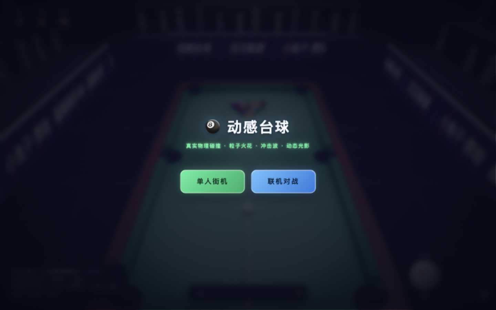
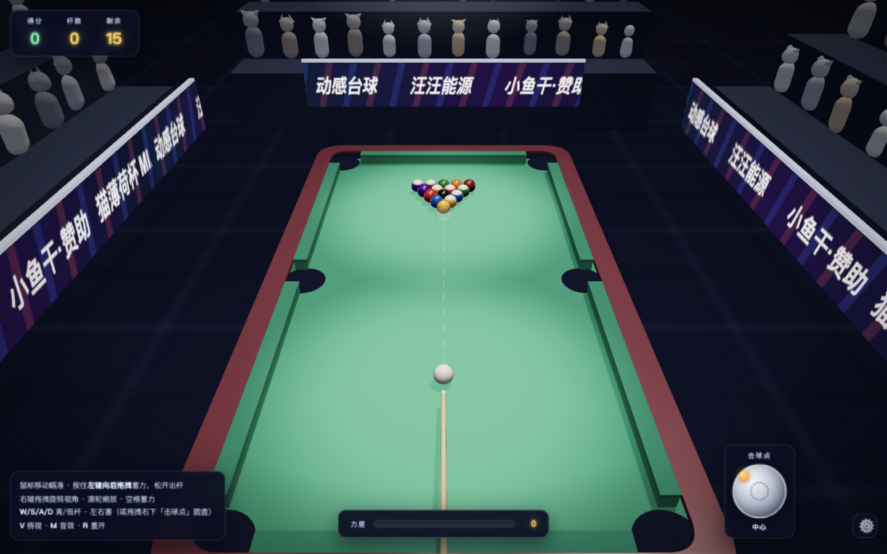
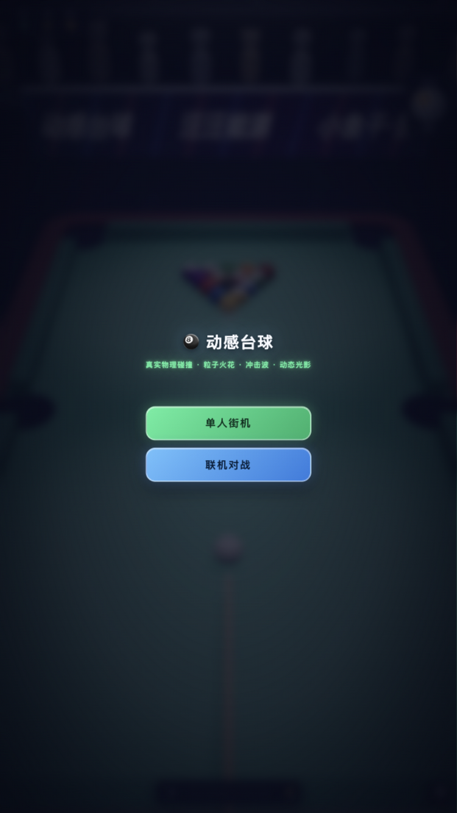
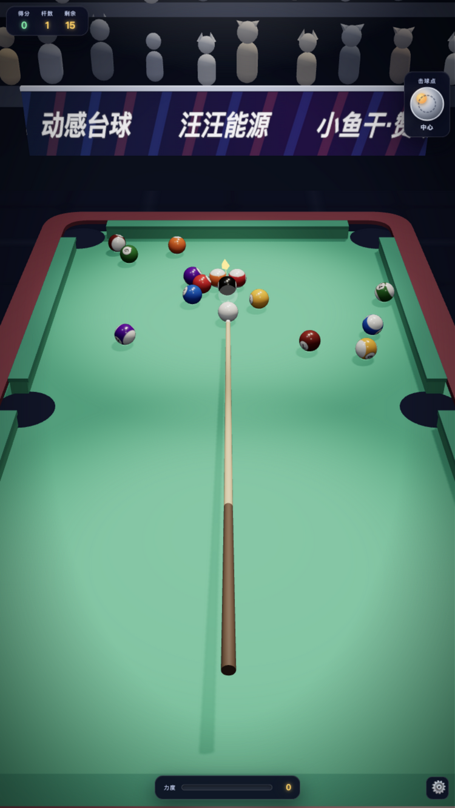

# 🎱 动感台球

纯前端、零构建的 3D 台球小游戏：**Three.js** 渲染 + 自研轻量物理引擎，粒子火花、冲击波、撞击闪光、镜头震动与 WebAudio 实时合成音效，支持**单人街机**与**联机对战（自动匹配 + 游客观战）**两种模式。

## 🖥️ 游戏画面





## 📱 手机端画面

 &nbsp;&nbsp; 

## 🎮 玩法

### 单人街机
- 每打进一球 **+100 分**；一杆多球有连击奖励（每额外一球 +50）
- 白球落袋为犯规：**-100 分**，白球重新摆回开球区
- 清空全部 15 颗彩球即胜利，结算得分 / 杆数 / 用时

### 八球规则（双人 / 联机对战）
- **分组**：开放球台阶段，首个合法落袋的球决定双方分组（全色 1-7 / 条纹 9-15）
- **犯规判定**（标准八球）：
  - 白球落袋
  - 未击中任何球
  - 首碰目标错误（开放台先碰黑八 / 未清完本组先碰黑八 / 碰到对方球组）
  - **无进球且无球碰库**：合法首碰之后，既没有球落袋、也没有任何球碰到库边
- **自由球（ball-in-hand）**：任何犯规后，对手可把白球摆到台面**任意合法位置**（不越界、不与活动球重叠、不落入袋口），鼠标 / 触屏均可完成摆放
- **黑八**：清完本组后合法打进黑八获胜；提前打进或带犯规打进黑八直接判负；开放球台阶段误进黑八摆回置球点继续

### 联机对战
- 两台设备打开同一地址，点击「联机对战」自动匹配，无需注册登录
- 自动分配搞笑昵称（哈基米、汪汪队、母球收藏家、袋口守门员…），房间内不重复
- **玩家1 = 房主（权威端）**：运行完整物理与规则，广播出杆快照与结算结果；自由球落点由权威端校验后同步
- **玩家2**：本地瞄准出杆，出杆请求交房主模拟执行；双方各自本地预测渲染，60fps 流畅
- 第 3 个及之后打开的人自动进入**观战视角**（可旋转/缩放，实时看双方瞄准与力度）
- 任一玩家离开 → 房间重置，自动等待新对手匹配

**操作**：移动鼠标瞄准 → 按住左键向后拖拽蓄力，松开出杆；右键旋转视角、滚轮缩放；`W/S` 高/低杆、`A/D` 左右塞（或拖拽「击球点」圆盘）；`V` 俯视、`M` 音效、`R` 重开。

## 🛡️ 联机安全

- **消息 schema 白名单校验**：客户端与服务端共用 `js/protocol.js`，所有联机消息按白名单结构 + 数值范围校验，多余字段一律剥除，非法消息整条拒收
- **角色权限**：带球面快照的权威出杆（`authoritativeShot`）、结算（`settled`）、重开、自由球广播仅房主可发；玩家2 只能发出杆请求（`shotRequest`）与自由球落点（`placeCue`），伪造的快照字段在服务端被剥除
- **XSS 防护**：胜负原因只接受规则引擎枚举值；结算文案全部 `textContent` 渲染；HTTP 响应带 CSP（`frame-ancestors 'none'`）、`X-Content-Type-Options` 等安全头
- **传输层防护**：WebSocket 校验 Origin 白名单（可用环境变量 `ALLOWED_ORIGINS` 追加）、16KB 消息上限、每 IP 连接数 / 观战总数上限、令牌桶消息限频、ping/pong 心跳清理死连接、广播背压保护；畸形 URL 编码返回 400 不影响进程

## 🧪 测试与 CI

```bash
npm test        # 一条命令跑完全部测试（随机端口自动拉起服务器，测完即关）
npm run test:phys      # 杆法物理
npm run test:rules     # 八球规则（含碰库犯规 / 自由球校验）
npm run test:protocol  # 联机消息 schema 校验
npm run test:server    # 服务端联机（角色权限 / 恶意消息 / Origin / 限流）
```

GitHub Actions 在每次 push 时先跑全量测试（`npm ci` + `npm test` + `npm audit`），**测试失败会阻止静态页面部署**。

## 🚀 本地运行 / 联机

```bash
npm install
npm start        # 打开 http://localhost:8250，同局域网设备访问 http://<本机IP>:8250
```

线上联机服务器部署在 Render（见 `render.yaml`），静态页面由 GitHub Pages 托管；地址配置在 `js/config.js`。
