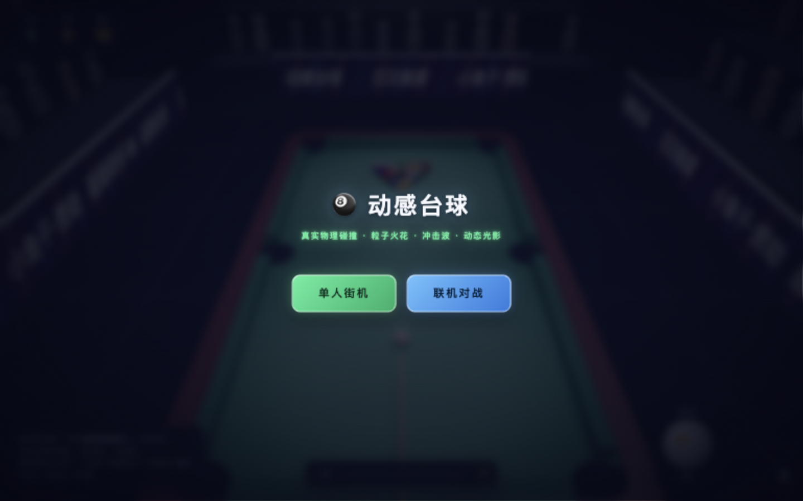
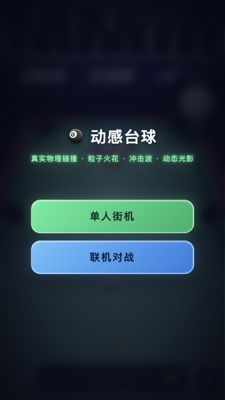
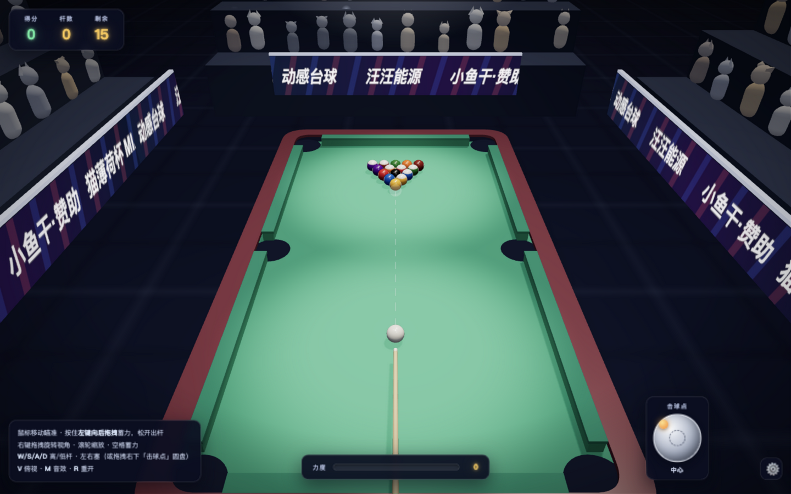
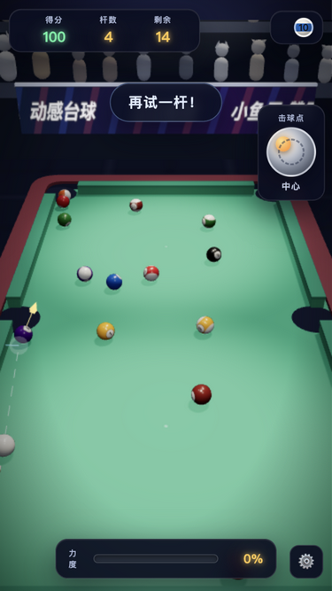
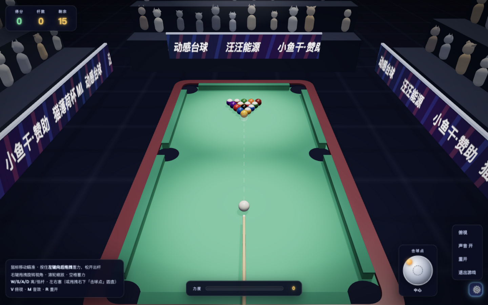
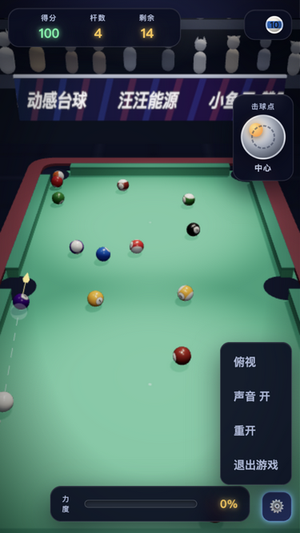

# 🎱 动感台球

纯前端、零构建的 3D 台球小游戏：**Three.js** 渲染 + 自研轻量物理引擎，粒子火花、冲击波、撞击闪光、镜头震动与 WebAudio 实时合成音效，支持**单人街机 / 本地同屏双人 / 联机对战（自动匹配 + 游客观战）**三种模式。

## 📸 截图

| PC | 移动端 |
| --- | --- |
|  |  |
|  |  |
|  |  |

## 🎮 玩法

- **单人街机**：进球得分（一杆多球有连击奖励），白球落袋罚分，清空 15 颗彩球即胜利
- **双人对战（同屏八球）**：自动分配搞笑昵称，开放球台首球定组，标准八球规则（犯规换人、黑八定胜负）
- **联机对战**：两台设备打开同一地址自动匹配，第三台起自动进入观战视角；房主为权威端，玩家端本地预测渲染 60fps

**操作**：移动鼠标瞄准 → 按住左键向后拖拽蓄力，松开出杆；右键旋转视角、滚轮缩放；`W/S` 高/低杆、`A/D` 左右塞（或拖拽「击球点」圆盘）；`V` 俯视、`M` 音效、`R` 重开。

## 🧰 技术栈

| 模块 | 说明 |
| --- | --- |
| Three.js r149 | 3D 场景渲染（本地化，可离线，零构建） |
| `js/physics.js` | 自研物理引擎：固定步长 1/360s 子步积分、球-球弹性碰撞、库边反弹、袋口判定、瞄准射线预测 |
| `js/rules.js` | 八球规则引擎（与渲染解耦，19 项决策表单元测试） |
| `js/effects.js` | 粒子池、冲击波环、撞击光源、镜头震动 |
| `js/audio.js` | WebAudio 实时合成音效（碰撞脆响、落袋、欢呼声浪，零音频素材） |
| `js/net.js` + `server.js` | WebSocket 联机：房间自动匹配、权威端快照广播、观战中继 |
| Canvas 2D | 球体数字贴图实时绘制（全色/条纹/白球） |

## 🚀 运行

```bash
# 单人 / 本地双人：直接双击 index.html 即可
# 联机对战：
npm install     # 安装 ws
node server.js  # 打印本机地址 http://192.168.x.x:8250
```

两台电脑用浏览器打开服务器地址，点「联机对战」自动匹配；第 3 人起自动观战。云端部署见 `netlify.toml`（静态站）与 `render.yaml`（免费联机服务器，冷启动约 1 分钟，客户端自动重连）。调手感可以改 `js/physics.js` 顶部常量（摩擦、反弹系数、袋口松紧）与 `game.js` 的 `MAX_SHOT_SPEED`。

## 🧪 测试

```bash
node test-server.js    # 服务器自动化测试
node js/physics.test.js  # 物理引擎单元测试
```